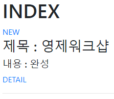
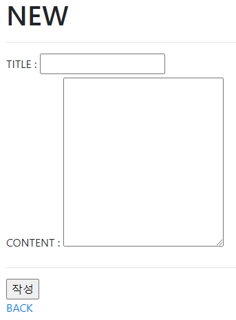
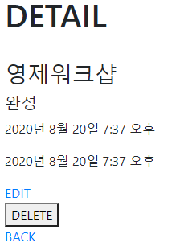
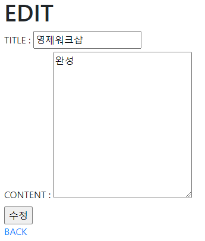

# 0820_homeworkshop_전영제

## Homework

### prob 1

```
python manage.py makemigrations
python manage.py migrate
```

### prob 2

~~~
3번
~~~

### prob 3

```
2번
네거티브 인덱스는 장고에서 지원하지 않는다(파이썬과 다름)
```

### prob 4

```
my_post.title='안녕하세요'
my_post.content='반갑습니다'
```

### prob 5

```
Post.objects.all()
```


## Workshop

### prob 1



```

```

### prob 2



```

```

### prob 3



```

```

### prob 4



```

```

### prob 5

```

```

